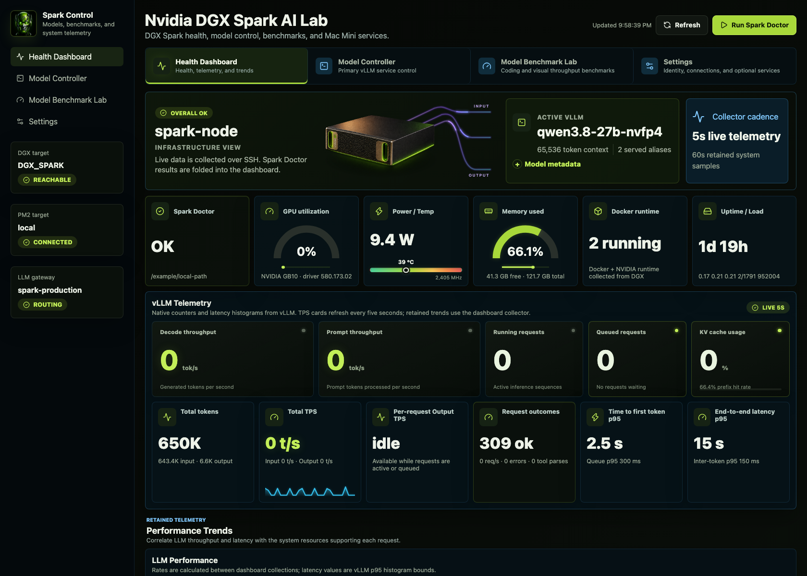
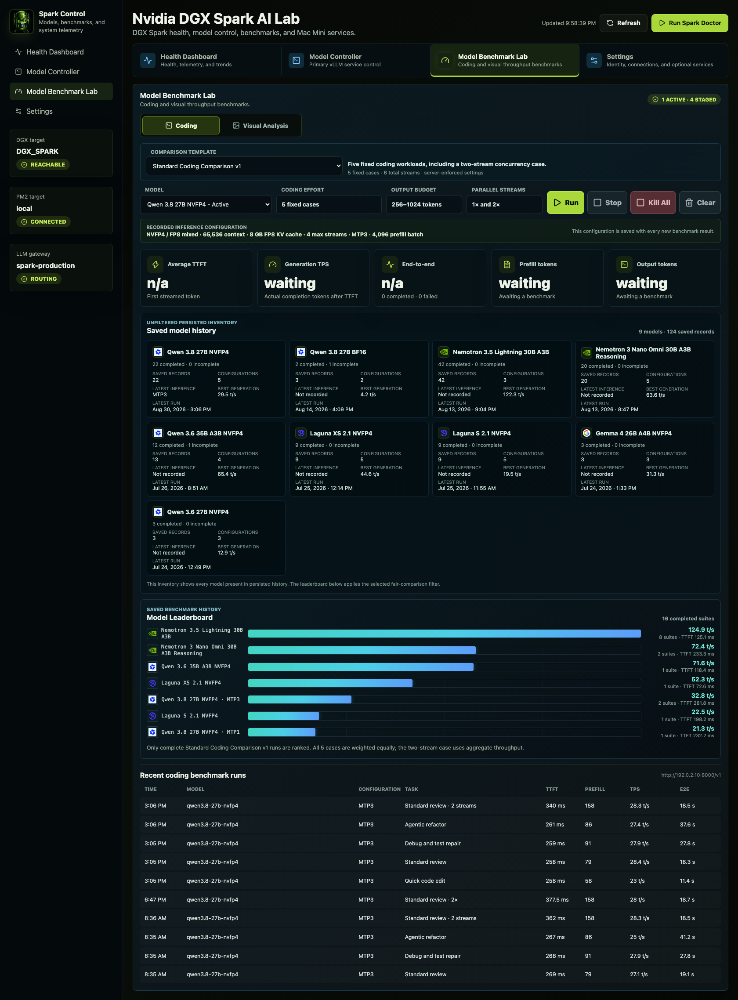
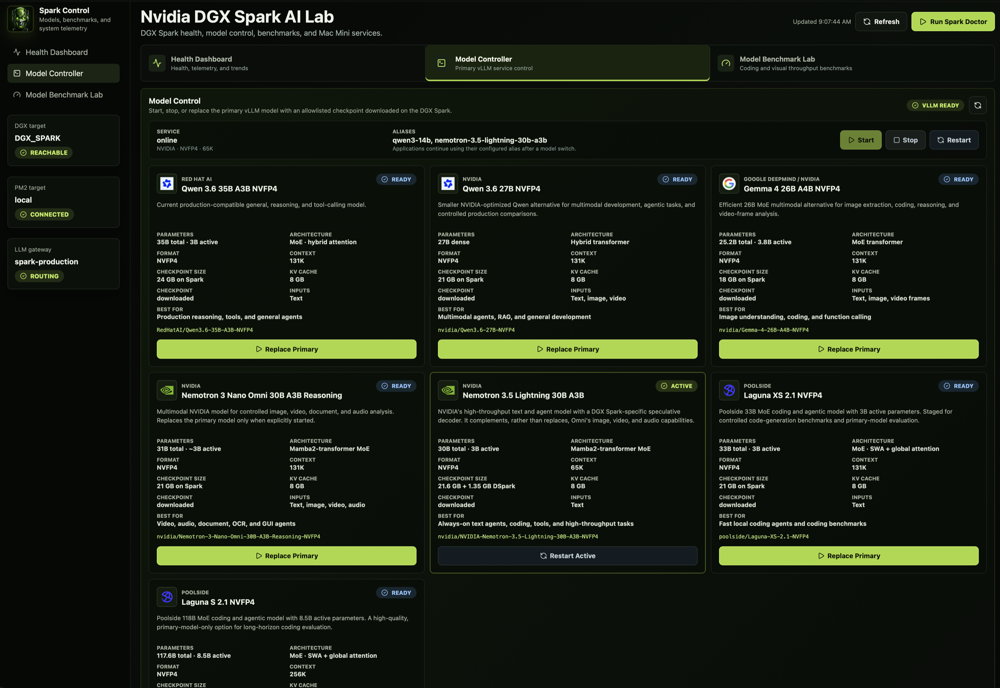
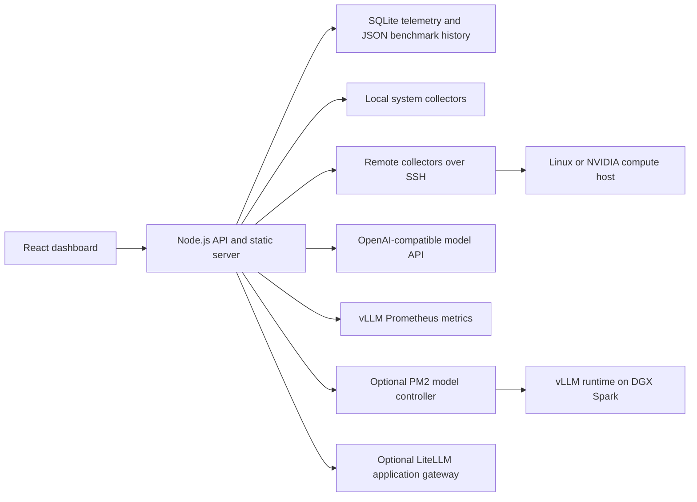

<div align="center">

# ⚡ NVIDIA DGX Spark AI Lab ⚡

### Health, model control, and repeatable inference benchmarks for local AI systems

[](#deployment-options)
[](#tech-stack)
[](#quick-start)
[](#architecture)
[](LICENSE)

by [Brian McGuire](https://x.com/brianmcguire)

[](https://x.com/brianmcguire)

</div>

A self-hosted operations dashboard for local AI inference: system health, vLLM telemetry, guarded model switching, and repeatable coding and visual benchmarks.

Use it on one computer, or run the dashboard separately from a remote NVIDIA compute host. Monitoring and benchmarking work with a reachable OpenAI-compatible endpoint; full model lifecycle control is designed for a DGX Spark running vLLM under PM2.

> This is an independent community project. It is not affiliated with or endorsed by NVIDIA. NVIDIA, DGX, and DGX Spark are trademarks of NVIDIA Corporation.

## Contents

- [Screenshots](#screenshots)
- [Why This Project](#why-this-project)
- [Features](#features)
- [Deployment Options](#deployment-options)
- [Quick Start](#quick-start)
- [Architecture](#architecture)
- [Tech Stack](#tech-stack)
- [How Model Control Works](#how-model-control-works)
- [Configuration](#configuration)
- [API](#api)
- [Repository Layout](#repository-layout)
- [Security](#security)
- [Development](#development)
- [Roadmap](#roadmap)

## Screenshots

### Health Dashboard

Monitor system health, live vLLM throughput, request activity, latency, and retained performance trends.



### Model Benchmark Lab

Run repeatable coding and visual benchmark suites and compare model throughput, latency, and token usage.



### Model Controller

Review available models, confirm readiness, and replace the active primary model through guarded lifecycle controls.



## Why This Project

Most inference dashboards stop at charts. DGX Spark AI Lab combines observability with operational workflows:

- **See the whole request path:** system resources, vLLM metrics, endpoint health, queues, caches, and latency percentiles.
- **Change models deliberately:** readiness polling, application compatibility probes, and automatic rollback protect the current primary model.
- **Compare models consistently:** fixed benchmark suites preserve prompt, output, and concurrency settings across runs.
- **Start safely:** the default installation is read-only, localhost-only, and does not start or replace a model.
- **Adapt to the host:** unavailable hardware and services are hidden instead of producing broken panels.

## Features

| Area | Capabilities |
| --- | --- |
| System health | CPU, memory, disk, network, NVIDIA GPU, power, temperature, Docker, and optional PM2 telemetry |
| Inference telemetry | Input/output TPS, request rate, queue depth, KV and prefix cache, latency percentiles, endpoint health, and speculative decoding |
| Model controller | Downloaded-model inventory, optional cache discovery, launch recipes, readiness checks, smoke tests, and rollback |
| Benchmark lab | Coding and visual suites, streamed output, TTFT, prefill tokens, generation TPS, end-to-end latency, concurrency, and saved leaderboards |
| Deployment | Local collectors or remote SSH collection, optional LiteLLM gateway health, PM2 service mode, and private-network access |
| Interface | Capability-driven desktop and mobile views with installation-specific title and branding |

## Deployment Options

| Topology | Health | Benchmarks | Model control | Typical use |
| --- | --- | --- | --- | --- |
| One Mac, Linux PC, or DGX system | Yes | Optional | DGX/vLLM profile only | Personal workstation or single-box lab |
| Dashboard host plus remote compute over SSH | Yes | Yes | DGX/vLLM profile only | Mac mini dashboard with a DGX Spark compute host |
| Any OpenAI-compatible inference endpoint | Basic | Yes | No | Portable model benchmarking |

Rich NVIDIA and vLLM panels appear only when their telemetry is available. A Mac-only installation does not require a DGX Spark.

## Quick Start

### Requirements

- Node.js 22 or newer
- npm
- Optional: an OpenAI-compatible endpoint for benchmarks
- Optional: passwordless SSH, vLLM, and PM2 for remote DGX model control

### Install

```bash
git clone https://github.com/brianmcguire/dgx-spark-ai-lab.git
cd dgx-spark-ai-lab
npm ci
npm run setup
npm run doctor
npm run build
npm start
```

Open `http://127.0.0.1:4174`. The setup wizard creates an ignored local configuration file and defaults to read-only localhost access.

### Run as a Service

```bash
npm install --global pm2
npm run build
npm run pm2:start
pm2 save
```

Follow [deployment guidance](docs/DEPLOYMENT.md) to restore the service after a reboot and expose it only through a trusted private network.

## Architecture



### Data Flow

1. The server collects local or remote system telemetry on a configured cadence.
2. The inference adapter reads `/v1/models` and vLLM Prometheus metrics when available.
3. Health samples are retained in SQLite; benchmark results are stored locally as structured JSON.
4. The React client renders only the capabilities enabled by the active profile.
5. Write operations require the configured control token unless an explicit trusted-network exception is enabled.
6. A model replacement is accepted only after readiness and compatibility checks pass; otherwise the prior launch script is restored.

More detail is available in [Architecture](docs/ARCHITECTURE.md).

## Tech Stack

| Layer | Technology |
| --- | --- |
| Web client | React 19, Vite 8, Lucide icons, responsive CSS |
| Application server | Node.js 22 built-in HTTP server and Fetch API |
| Telemetry history | Node SQLite with WAL mode and configurable retention |
| Benchmark history | Local structured JSON with normalized model identities |
| Inference integration | OpenAI-compatible API and vLLM Prometheus metrics |
| Remote collection | SSH plus standard Linux and NVIDIA command-line tools |
| Process management | Optional PM2 for the dashboard, gateway, and vLLM service |
| Application routing | Optional LiteLLM stable alias in front of the replaceable primary model |
| Tests | Node test runner plus production Vite build validation |

## How Model Control Works

The controller separates **model inventory** from **safe launch recipes**:

1. The catalog lists models approved for this installation and their model-specific vLLM arguments.
2. Optional Hugging Face cache discovery finds other downloaded checkpoints.
3. Unknown checkpoints appear as **Discovered / Setup Required** and cannot be launched until an operator adds a reviewed recipe.
4. At startup, the dashboard adopts whichever model `/v1/models` reports as active. It does not automatically replace it.
5. During replacement, the dashboard preserves the prior launch script, starts the candidate, polls readiness, runs smoke and gateway compatibility probes, and rolls back on failure.

This avoids treating every model as interchangeable. Tool parsers, context limits, quantization, multimodal options, and runtime images can differ even when checkpoints use the same API.

## Configuration

Run `npm run setup` to create `config/dashboard.local.json`. Local configuration and secrets are ignored by Git.

| Profile | Mode | Purpose |
| --- | --- | --- |
| Local monitoring | `readonly` | Health and available telemetry without write operations |
| Local benchmarking | `benchmark` | Adds requests to a local or reachable OpenAI-compatible endpoint |
| Remote DGX Spark | `full` | SSH telemetry plus optional vLLM/PM2 model control |

Advanced examples:

- `config/default.json`
- `config/local-benchmark.example.json`
- `config/remote-dgx.example.json`
- `config/models.example.json`

Configuration loads from defaults, then the ignored local file, then supported environment overrides. See [Configuration](docs/CONFIGURATION.md) for model discovery, catalog recipes, capability flags, and precedence.

The upper-left profile image is bundled as `public/dgx-spark-icon.png` and included in every install and production build. It can be replaced with a local or hosted image through `dashboard.logoUrl`; invalid custom images fall back to the bundled default.

## API

The browser uses these local endpoints. Write routes require control authorization when enabled.

| Method | Endpoint | Purpose |
| --- | --- | --- |
| `GET` | `/api/config` | Public dashboard capabilities and labels |
| `GET` | `/api/status` | Current health snapshot |
| `GET` | `/api/history` | Retained system and inference telemetry |
| `GET` | `/api/vllm/live` | Live vLLM metrics |
| `GET` | `/api/models/control` | Model inventory and controller status |
| `POST` | `/api/models/control` | Start, stop, restart, or replace the primary model |
| `GET` | `/api/latency/models` | Active model and benchmark definitions |
| `GET` | `/api/latency/history` | Saved benchmark runs |
| `POST` | `/api/latency/run` | Run a streamed benchmark |
| `POST` | `/api/latency/stop` | Stop one benchmark |
| `POST` | `/api/latency/kill-all` | Stop all active benchmarks |
| `POST` | `/api/spark-doctor/run` | Run optional Spark Doctor diagnostics |

Benchmark output is streamed with server-sent events so individual runs and metrics update while generation is active.

## Repository Layout

```text
.
├── config/                 Example dashboard and model catalogs
├── docs/                   Architecture, configuration, deployment, and images
├── examples/litellm/       Optional stable application gateway example
├── public/                 App icon, manifest, and model-provider logos
├── scripts/                Interactive setup and environment doctor
├── server/                 HTTP API, collectors, discovery, control, and storage
├── src/                    React dashboard and responsive styling
├── test/                   Configuration and model-discovery tests
├── ecosystem.config.cjs    PM2 service definition
└── SECURITY.md             Deployment boundary and reporting policy
```

## Security

Model replacement and benchmark routes can consume substantial resources or interrupt applications. For a write-enabled installation:

```bash
export DASHBOARD_CONTROL_TOKEN='use-a-long-random-value'
npm start
```

Use the **Unlock** command in the dashboard to enter that token. Keep the dashboard on localhost or a private network such as Tailscale. Do not publish the service directly to the internet.

The server fails closed when a write-enabled profile is bound beyond loopback without a token, unless the operator deliberately enables the trusted-network exception. Review [Security](SECURITY.md) before enabling model control.

## Development

```bash
npm run dev
npm test
npm run build
```

Run the complete validation before opening a pull request:

```bash
npm run check
```

See [Contributing](CONTRIBUTING.md) for project rules and credential hygiene.

## Roadmap

The next packaging and observability improvements under consideration are:

- Docker and Docker Compose installation for a reproducible read-only or benchmark deployment
- Multiple named inference endpoints in one dashboard
- Pluggable collector adapters beyond vLLM while preserving capability-based panels
- Optional push-based live telemetry for larger or multi-host installations
- Import and export of benchmark suites and anonymized results

Power controls, arbitrary remote command execution, and automatic launch recipes for unknown models are intentionally outside the default safety boundary.

## License

[MIT](LICENSE)
