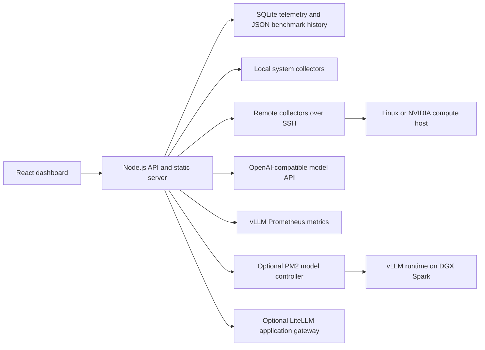

<div align="center">

# ⚡ Spark AI Lab ⚡

### Open-source inference monitoring, model control, and repeatable benchmarks for NVIDIA DGX Spark and compatible Linux hosts

[](#deployment-options)
[](#tech-stack)
[](#quick-start)
[](#inference-engine-support)
[](#inference-engine-support)
[](LICENSE)

by [Brian McGuire](https://x.com/brianmcguire)

[](https://x.com/brianmcguire)

</div>

A self-hosted operations dashboard for local AI inference: system health, inference telemetry, guarded model switching, and repeatable coding and visual benchmarks.

Use it on one computer, or run the dashboard separately from a remote NVIDIA compute host. Host monitoring does not require vLLM. Benchmarking works with a reachable OpenAI-compatible endpoint from vLLM or another inference engine. The enhanced telemetry and full model lifecycle controls currently use vLLM-specific metrics and a DGX Spark vLLM service managed by PM2.

> **Independent project notice:** Spark AI Lab is not affiliated with, sponsored by, or endorsed by NVIDIA Corporation. NVIDIA, the NVIDIA logo, DGX, and DGX Spark are trademarks and/or registered trademarks of NVIDIA Corporation in the United States and other countries.

## Contents

- [Screenshots](#screenshots)
- [Why This Project](#why-this-project)
- [Features](#features)
- [Deployment Options](#deployment-options)
- [Inference Engine Support](#inference-engine-support)
- [Quick Start](#quick-start)
- [Architecture](#architecture)
- [Tech Stack](#tech-stack)
- [How Model Control Works](#how-model-control-works)
- [Configuration](#configuration)
- [API](#api)
- [Repository Layout](#repository-layout)
- [Security](#security)
- [Development](#development)
- [Roadmap](#roadmap)

## Screenshots

### Health Dashboard

Monitor system health, live vLLM throughput, request activity, latency, and retained performance trends.


#### What the Health Dashboard Monitors

The dashboard combines live inference telemetry with retained host metrics so model behavior can be compared with the resources supporting each request.

| Area | Included diagnostics |
| --- | --- |
| System health | CPU and load, unified memory, disk, network, uptime, Docker, and optional PM2 services |
| NVIDIA telemetry | GPU utilization, power, temperature, clock speed, device, and driver details |
| vLLM activity | Input, output, and total TPS; token counts; request rate and outcomes; running and waiting requests |
| Cache and scheduling | KV-cache utilization, prefix-cache hit rate, and request queue pressure |
| Latency | Time to first token, queue time, end-to-end latency, and inter-token latency with p50, p95, and p99 views |
| Inference diagnostics | Speculative-decoding acceptance, acceptance by token position, and prompt/output-size distributions |
| Endpoint health | `/v1/models`, `/metrics`, gateway-to-vLLM connectivity, and a synthetic completion probe with measured latency |

When vLLM metrics are configured, live inference cards refresh every five seconds. Retained performance charts correlate throughput, request pressure, and latency with GPU, memory, CPU, disk, network, and process activity over time. Optional collectors are capability-driven, so sections such as PM2, vLLM latency histograms, or speculative decoding are shown only when the configured environment exposes them.

When the separately installed [Spark Doctor](https://github.com/joeynyc/spark-doctor) integration is enabled and detected, the dashboard exposes an on-demand DGX diagnostic action and folds its latest result into the health view. Clean installations hide these controls. See [Third-Party Notices](THIRD_PARTY_NOTICES.md) for attribution.

### Model Benchmark Lab

Run repeatable coding and visual benchmark suites and compare model throughput, latency, and token usage.


#### Comparison Scenarios

**Standard Coding Comparison v1** provides an apples-to-apples model comparison with five server-enforced workloads:

| Scenario | What it tests | Output budget | Streams |
| --- | --- | ---: | ---: |
| Quick code edit | Small, focused TypeScript implementation | 256 tokens | 1 |
| Standard review | API refactoring, validation, timeouts, and tests | 512 tokens | 1 |
| Debug and test repair | Root-cause analysis, a minimal safe patch, and regression coverage | 768 tokens | 1 |
| Agentic refactor | Multi-step design, production code, assumptions, and a test matrix | 1,024 tokens | 1 |
| Concurrent standard review | Aggregate throughput and latency under simultaneous requests | 512 tokens | 2 |

For targeted testing, **Single Scenario** mode also includes structured JSON and tool contracts, multi-file feature implementation, long-context code review, custom coding prompts, adjustable output budgets, and 1–8 parallel streams.

**Visual Analysis** benchmarks image-capable models with a fixed synthetic test image:

- **Image extraction:** object counts, colors, shapes, positions, and strict JSON output.
- **Visual reasoning:** spatial relationships, relative positions, and grounded scene summaries.

Every run records time to first token (TTFT), prefill tokens, generation TPS, end-to-end latency, output tokens, completion status, and streamed model output. Saved leaderboards rank complete fixed-suite runs, keeping prompts, token budgets, and concurrency settings consistent across models.

### Model Controller

Review available models, confirm readiness, and replace the active primary model through guarded lifecycle controls.


#### Model Inventory and Lifecycle

The controller combines reviewed model recipes with optional Hugging Face cache discovery. Each model card identifies its provider, total and active parameters, architecture, quantization format, context limit, checkpoint size, KV-cache allocation, supported inputs, and recommended workload.

| State | Meaning |
| --- | --- |
| Active | The model currently serving the primary vLLM endpoint and stable application alias |
| Ready | The checkpoint is downloaded and has a reviewed launch recipe |
| Loading | The candidate process is starting and progressing through model load and readiness checks |
| Discovered / Setup Required | A local checkpoint was found, but its launch arguments must be reviewed before it can be started |
| Unavailable | A configured checkpoint is not present or cannot currently be resolved on the target host |

#### Guarded Model Replacement

When **Replace Primary** is selected, the controller:

1. Saves the current known-good launch configuration.
2. Stops the active model and starts the selected candidate on the primary endpoint.
3. Tracks startup using process state, logs, memory growth, shard loading, and endpoint readiness.
4. Runs a model-appropriate smoke test for text generation or tool calling.
5. Runs configured gateway and agent compatibility checks for downstream applications.
6. Marks the candidate active only after validation succeeds, or automatically restores the prior model if startup or validation fails.

Applications can continue using one stable endpoint and alias while the underlying model changes. Model-specific recipes can define the runtime image, quantization, context and cache limits, tool and reasoning parsers, multimodal settings, and speculative-decoding configuration without hard-coding those choices into the dashboard.

The controller also provides explicit **Start**, **Stop**, and **Restart** service actions. For safety, lifecycle control is read-only by default and must be enabled in the local configuration before remote model changes are allowed.

## Why This Project

Most inference dashboards stop at charts. Spark AI Lab combines observability with operational workflows:

- **See the whole request path:** system resources, vLLM metrics, endpoint health, queues, caches, and latency percentiles.
- **Change models deliberately:** readiness polling, application compatibility probes, and automatic rollback protect the current primary model.
- **Compare models consistently:** fixed benchmark suites preserve prompt, output, and concurrency settings across runs.
- **Start safely:** the default installation is read-only, localhost-only, and does not start or replace a model.
- **Adapt to the host:** unavailable hardware and services are hidden instead of producing broken panels.

## Features

| Area | Capabilities |
| --- | --- |
| System health | CPU, memory, disk, network, NVIDIA GPU, power, temperature, Docker, and optional PM2 telemetry |
| Inference telemetry | Input/output TPS, request rate, queue depth, KV and prefix cache, latency percentiles, endpoint health, and speculative decoding |
| Model controller | Downloaded-model inventory, optional cache discovery, launch recipes, readiness checks, smoke tests, and rollback |
| Benchmark lab | Coding and visual suites, streamed output, TTFT, prefill tokens, generation TPS, end-to-end latency, concurrency, and saved leaderboards |
| Deployment | Local collectors or remote SSH collection, optional LiteLLM gateway health, PM2 service mode, and private-network access |
| Interface | Capability-driven desktop and mobile views with installation-specific title and branding |

## Deployment Options

| Topology | Health | Benchmarks | Model control | Typical use |
| --- | --- | --- | --- | --- |
| One Mac, Linux PC, or DGX system | Yes | Optional | DGX/vLLM profile only | Personal workstation or single-box lab |
| Dashboard host plus remote compute over SSH | Yes | Yes | DGX/vLLM profile only | Mac mini dashboard with a DGX Spark compute host |
| Any OpenAI-compatible inference endpoint | Basic | Yes | No | Portable model benchmarking |

Rich NVIDIA and vLLM panels appear only when their telemetry is available. A Mac-only installation does not require a DGX Spark.

## Inference Engine Support

vLLM is the most complete integration, but it is not required for the entire project.

| Capability | vLLM | Other OpenAI-compatible engine |
| --- | --- | --- |
| Host health and resource monitoring | Yes | Yes |
| Coding and visual benchmark requests | Yes | Yes, when the endpoint supports the request format and selected modality |
| Streamed output, TTFT, TPS, token counts, and end-to-end timing | Yes | Yes, when the endpoint returns standard streaming and usage data |
| Native queue, cache, latency-histogram, and speculative-decoding telemetry | Yes | Not until an engine-specific metrics adapter is available |
| Dashboard-managed model start, stop, and replacement | Yes, with the DGX/vLLM controller profile | No; manage the engine externally |

Users can point the benchmark profile at any compatible `/v1` endpoint, including an independently managed local or remote engine. Engines such as SGLang, llama.cpp, Ollama, or Text Generation Inference may work when their OpenAI-compatible API behavior matches the benchmark client, but they are not yet first-class telemetry or lifecycle-control integrations.

The adapter boundary is intentional: a future engine integration can map its health and metrics into the dashboard's capability model without changing the benchmark UI. Unsupported panels remain hidden rather than reporting misleading zero values.

## Quick Start

### Requirements

- Node.js 22 or newer
- npm
- Optional: an OpenAI-compatible endpoint for benchmarks
- Optional: passwordless SSH, vLLM, and PM2 for remote DGX model control

### Install

```bash
git clone https://github.com/brianmcguire/dgx-spark-ai-lab.git
cd dgx-spark-ai-lab
npm ci
npm run setup
npm run doctor
npm run build
npm start
```

Open `http://127.0.0.1:4174`. The setup wizard creates an ignored local configuration file and defaults to read-only localhost access. After startup, use the **Settings** tab to adjust branding, host connections, inference endpoints, and optional integrations without editing JSON. Restart the dashboard after saving settings so every collector uses the new configuration.

### Run as a Service

```bash
npm install --global pm2
npm run build
npm run pm2:start
pm2 save
```

Follow [deployment guidance](docs/DEPLOYMENT.md) to restore the service after a reboot and expose it only through a trusted private network.

## Architecture



### Data Flow

1. The server collects local or remote system telemetry on a configured cadence.
2. The inference adapter reads `/v1/models` and vLLM Prometheus metrics when available.
3. Health samples are retained in SQLite; benchmark results are stored locally as structured JSON.
4. The React client renders only the capabilities enabled by the active profile.
5. Write operations require the configured control token unless an explicit trusted-network exception is enabled.
6. A model replacement is accepted only after readiness and compatibility checks pass; otherwise the prior launch script is restored.

More detail is available in [Architecture](docs/ARCHITECTURE.md).

## Tech Stack

| Layer | Technology |
| --- | --- |
| Web client | React 19, Vite 8, Lucide icons, responsive CSS |
| Application server | Node.js 22 built-in HTTP server and Fetch API |
| Telemetry history | Node SQLite with WAL mode and configurable retention |
| Benchmark history | Local structured JSON with normalized model identities |
| Inference integration | OpenAI-compatible API and vLLM Prometheus metrics |
| Remote collection | SSH plus standard Linux and NVIDIA command-line tools |
| Process management | Optional PM2 for the dashboard, gateway, and vLLM service |
| Application routing | Optional LiteLLM stable alias in front of the replaceable primary model |
| Tests | Node test runner plus production Vite build validation |

## How Model Control Works

The controller separates **model inventory** from **safe launch recipes**:

1. The catalog lists models approved for this installation and their model-specific vLLM arguments.
2. Optional Hugging Face cache discovery finds other downloaded checkpoints.
3. Unknown checkpoints appear as **Discovered / Setup Required** and cannot be launched until an operator adds a reviewed recipe.
4. At startup, the dashboard adopts whichever model `/v1/models` reports as active. It does not automatically replace it.
5. During replacement, the dashboard preserves the prior launch script, starts the candidate, polls readiness, runs smoke and gateway compatibility probes, and rolls back on failure.

This avoids treating every model as interchangeable. Tool parsers, context limits, quantization, multimodal options, and runtime images can differ even when checkpoints use the same API.

## Configuration

Run `npm run setup` to create `config/dashboard.local.json`. Local configuration and secrets are ignored by Git.

The **Settings** tab provides a guided editor for common, non-secret options:

- Dashboard title, sidebar identity, logo, mode, host, and port
- Local or SSH compute connection
- OpenAI-compatible inference and metrics endpoints
- Optional PM2 and gateway visibility

Settings controlled by environment variables are shown as managed and cannot be overwritten in the browser. Security tokens, SSH credentials, model launch recipes, arbitrary commands, and other privileged settings remain file- or environment-managed. This keeps the convenient editor from becoming a remote administration surface.

| Profile | Mode | Purpose |
| --- | --- | --- |
| Local monitoring | `readonly` | Health and available telemetry without write operations |
| Local benchmarking | `benchmark` | Adds requests to a local or reachable OpenAI-compatible endpoint |
| Remote DGX Spark | `full` | SSH telemetry plus optional vLLM/PM2 model control |

Advanced examples:

- `config/default.json`
- `config/local-benchmark.example.json`
- `config/remote-dgx.example.json`
- `config/models.example.json`
- `config/dashboard.schema.json`

Configuration loads from defaults, then the ignored local file, then supported environment overrides. The included JSON Schema provides validation and editor completion for advanced configuration. See [Configuration](docs/CONFIGURATION.md) for guided settings, model discovery, catalog recipes, capability flags, and precedence.

The upper-left profile image is bundled as `public/dgx-spark-icon.png` and included in every install and production build. It can be replaced with a local or hosted image through `dashboard.logoUrl`; invalid custom images fall back to the bundled default.

## API

The browser uses these local endpoints. Write routes require control authorization when enabled.

| Method | Endpoint | Purpose |
| --- | --- | --- |
| `GET` | `/api/config` | Public dashboard capabilities and labels |
| `GET` | `/api/settings` | Editable settings and environment-managed state |
| `POST` | `/api/settings` | Validate and persist safe local settings |
| `GET` | `/api/status` | Current health snapshot |
| `GET` | `/api/history` | Retained system and inference telemetry |
| `GET` | `/api/vllm/live` | Live vLLM metrics |
| `GET` | `/api/models/control` | Model inventory and controller status |
| `POST` | `/api/models/control` | Start, stop, restart, or replace the primary model |
| `GET` | `/api/latency/models` | Active model and benchmark definitions |
| `GET` | `/api/latency/history` | Saved benchmark runs |
| `POST` | `/api/latency/run` | Run a streamed benchmark |
| `POST` | `/api/latency/stop` | Stop one benchmark |
| `POST` | `/api/latency/kill-all` | Stop all active benchmarks |
| `POST` | `/api/spark-doctor/run` | Run optional Spark Doctor diagnostics |

Benchmark output is streamed with server-sent events so individual runs and metrics update while generation is active.

## Repository Layout

```text
.
├── config/                 Example dashboard and model catalogs
├── docs/                   Architecture, configuration, deployment, and images
├── examples/litellm/       Optional stable application gateway example
├── public/                 App icon, manifest, and model-provider logos
├── scripts/                Interactive setup and environment doctor
├── server/                 HTTP API, collectors, discovery, control, and storage
├── src/                    React dashboard and responsive styling
├── test/                   Configuration and model-discovery tests
├── ecosystem.config.cjs    PM2 service definition
├── CHANGELOG.md            User-visible release history
├── THIRD_PARTY_NOTICES.md  Optional integration attribution
└── SECURITY.md             Deployment boundary and reporting policy
```

## Security

Model replacement and benchmark routes can consume substantial resources or interrupt applications. For a write-enabled installation:

```bash
export DASHBOARD_CONTROL_TOKEN='use-a-long-random-value'
npm start
```

Use the **Unlock** command in the dashboard to enter that token. Keep the dashboard on localhost or a private network such as Tailscale. Do not publish the service directly to the internet.

The server fails closed when a write-enabled profile is bound beyond loopback without a token, unless the operator deliberately enables the trusted-network exception. Review [Security](SECURITY.md) before enabling model control.

## Development

```bash
npm run dev
npm test
npm run build
```

Run the complete validation before opening a pull request:

```bash
npm run check
```

See [Contributing](CONTRIBUTING.md) for project rules and credential hygiene.

## Roadmap

The next packaging and observability improvements under consideration are:

- Docker and Docker Compose installation for a reproducible read-only or benchmark deployment
- A first-run connection test that can validate compute and inference endpoints before saving
- Multiple named inference endpoints in one dashboard
- Pluggable collector adapters beyond vLLM while preserving capability-based panels
- Optional push-based live telemetry for larger or multi-host installations
- Import and export of benchmark suites and anonymized results

Power controls, arbitrary remote command execution, and automatic launch recipes for unknown models are intentionally outside the default safety boundary.

## License

[MIT](LICENSE)
